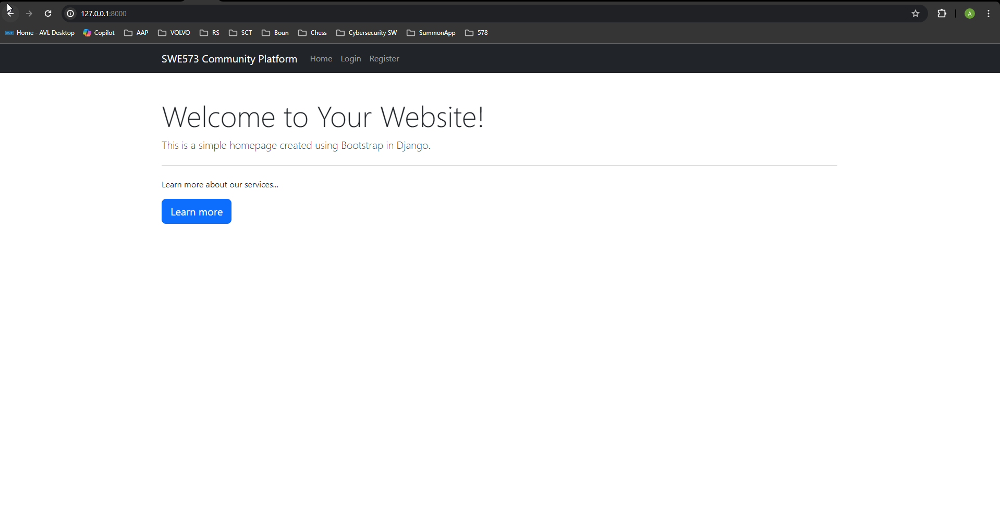
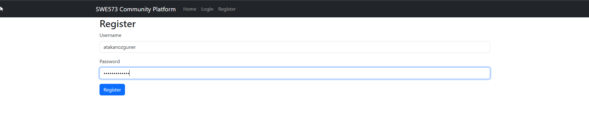
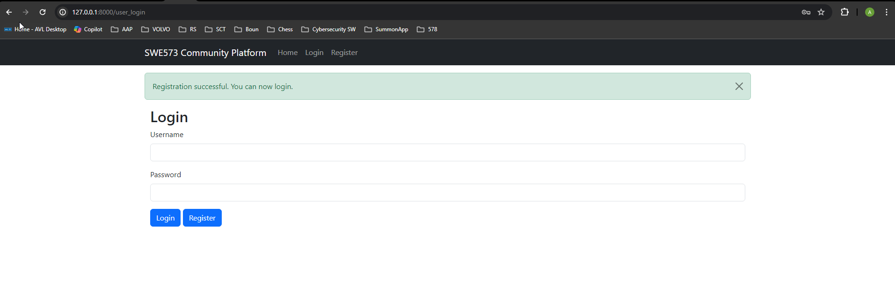
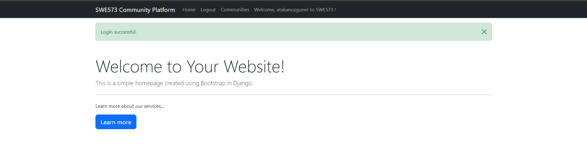
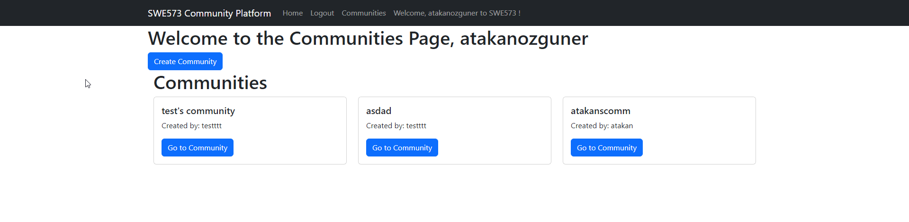
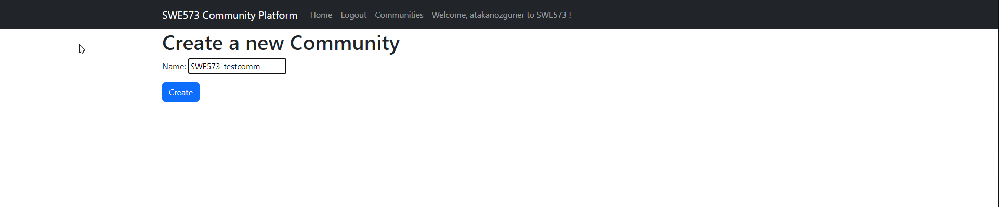
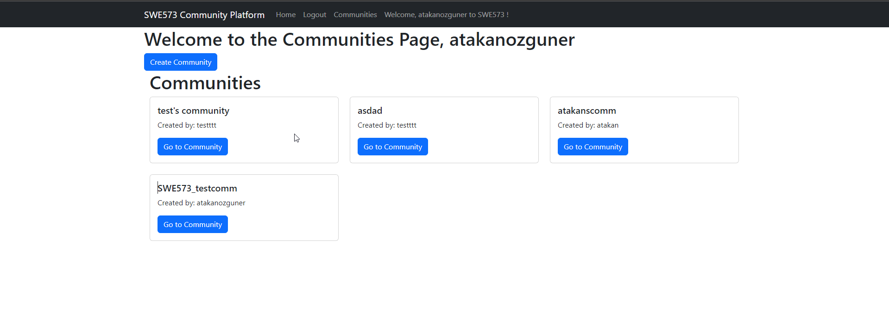

# swe573-Ozguner
SWE573 Repository - Atakan Ozguner

***For the first assignment a markdown file about https://github.com/public-apis/public-apis is added.***


## Application Setup

The application is located under `/virtualenv/swe573project`. 

As the Django and PostgreSQL services are dockerized, you can build and run the containers by navigating to the `/virtualenv/swe573project` directory and running the following command:

```bash
sudo docker-compose up --build
```

Because the service is running in docker containers, no need to activate virtualenv, it was created for development&debugging purposes only.

## Dockerfile Explanation

The Dockerfile is a text file that contains the instructions to build a Docker image. It automates the deployment of the application inside a container. Here's a breakdown of our Dockerfile:

1. `FROM python:3.10-slim`: This line is pulling the official Python image from DockerHub. We're using the slim version of Python 3.10.

2. `WORKDIR /app`: This line sets the working directory inside the Docker container to `/app`.

3. `COPY requirements.txt .`: This line copies the `requirements.txt` file from your local directory to the Docker container.

4. The next two blocks of `RUN` commands are updating the package list, installing `build-essential` and `libpq-dev` packages, and then cleaning up the package list. These packages are necessary for building certain Python packages.

5. `RUN pip install --no-cache-dir -r requirements.txt`: This line installs the Python dependencies listed in the `requirements.txt` file.

6. `COPY . .`: This line copies the rest of your local directory (the application code) into the Docker container.

7. `CMD ["python", "manage.py", "runserver", "0.0.0.0:8000"]`: This line is the command that Docker will execute by default when you run the container. In this case, it's starting the Django server.


## Docker Compose File Explanation

The `docker-compose.yml` file is a YAML file defining services, networks, and volumes for a Docker application. Here's a breakdown of our `docker-compose.yml` file:

1. `version: '3'`: This line specifies the version of Docker Compose file format. We're using version 3.

2. `services:`: This section is where we define our services. In this case, we have two services: `swe573-postgres` and `web`.

3. `swe573-postgres:`: This is our PostgreSQL service. We're using the official `postgres` image from DockerHub. We're also setting some environment variables to configure our PostgreSQL database.

4. `web:`: This is our Django service. We're building the Docker image using the Dockerfile in the current directory (`build: .`).

5. `command:`: This line is running a series of commands to make migrations, migrate the database, and then start the Django server. This ensures that Django's migrations are done automatically when the container is started.

6. `volumes:`: This line is mounting the current directory on the host to `/app` in the container. This allows us to make changes to our code on the host and have those changes reflected in the container.

7. `ports:`: This line is mapping port 8000 on the host to port 8000 in the container.

8. `depends_on:`: This line is specifying that the `web` service depends on the `swe573-postgres` service. This means that Docker Compose will start the `swe573-postgres` service first.


## Application Screenshots

### Home Page


### Register Page
Register with a username and a password.


### Login Page


### Home Page (Logged In)
After successful login you receive a message and top navigation bar changes. New fields such as Communities is added.


### Communities Page (1)
You can see created communities, go to their respective pages, and create a new community.


### Communities Page (2)
Creating a new community, first only define a community name.


### Communities Page (3)
Our new community is added. Lets navigate to it.


### Communities Page (4)
Here you can see post template's fields can be increased as required. After this step is to be done for my progress, unfortunately.
