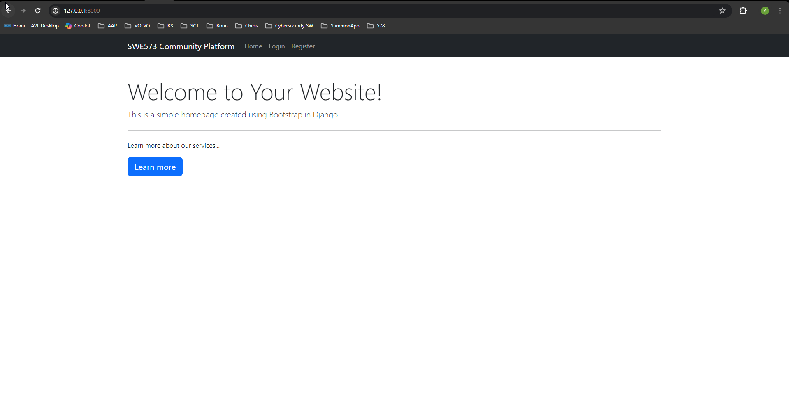
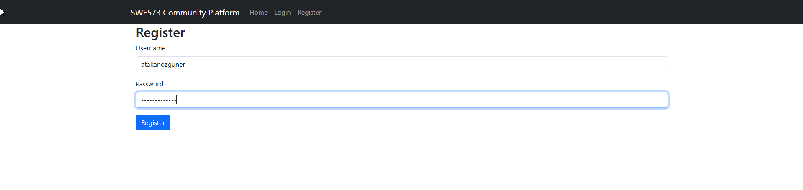
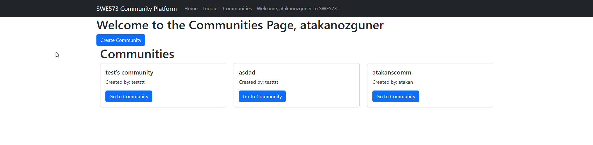
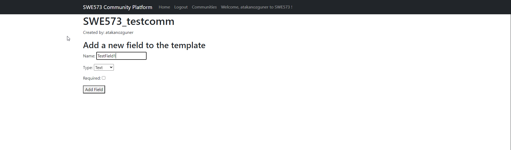

# SWE573 2024 Spring Milestone Report

## Atakan Ozguner

20.05.2024

# HONOR CODE
Related to the submission of all the project deliverables for the Swe573 2024 Spring
semester project reported in this report, I <Atakan Ozguner> declare that:
- I am a student in the Software Engineering MS program at Bogazici University and
am registered for Swe573 course during the Spring 2024 semester.
- All the material that I am submitting related to my project (including but not limited to the project repository, the final project report, and supplementary documents)
have been exclusively prepared by myself.
- I have prepared this material individually without the assistance of anyone else
with the exception of permitted peer assistance which I have explicitly disclosed in
this report.

Signed -/ Atakan Ozguner

# Table Of Content

1. Requirements
2. Repository
3. Register - Login
4. Building the application
5. Progress
6. Details and Remarks of implementation & Decisions
7. Application Screenshots ( From the progress report )

### Requirements

System has an updated readme.md, but it requires you to have docker. Deployment is heroku is something I couldn't rely on, I will also include deployment's link [here ](https://swe573-ozguner-fc769e0afc0d.herokuapp.com/)

### Repository
The project repository can be found at [this GitHub link](https://github.com/atakanozguner/swe573-Ozguner). The last version of the project is under the branch `main` as in the link.

[Github Tag Link v0.9](https://github.com/atakanozguner/swe573-Ozguner/releases/tag/v0.9)


### Register - Login

For user info and login, after running the docker compose file as instructed in the readme, database is also up and running and migration from models is done via commands in the docker compose file, so you will be able to use the Register page without a problem. After registration you can login with said credentials.


### Building the application

The application is located under `/virtualenv/swe573project`. 

As the Django and PostgreSQL services are dockerized, you can build and run the containers by navigating to the `/virtualenv/swe573project` directory and running the following command:

```bash
sudo docker-compose up --build
```

Because the service is running in docker containers, no need to activate virtualenv, it was created for development&debugging purposes only.

### Progress

Implemented features in **brief sentences** are: 

1. Register - Login functionality.
2. Community - Logout buttons and greeting message are not visible when user is not logged in.
3. Register - Login buttons are visible when user is logged in.
4. Under Community page, created communities are listed ( kept in PostgreSQL database ). Also Create Community button to navigate to community creation page is implemented.
5. In Create Community button, firstly just defining a name and description for community is enough. Creator is automatically assigned also as a moderator and follower.
6. Users can choose to follow the communities.
7. Moderators can initially be assigned by creators, mod's can assign new mods, and/or revoke their mod status.
8. Template creation and template displaying works just fine, all the details of the data is kept in a JSON field as intended, but displaying created posts kept bugging out so I had to omit them in order to have a smooth working final deliverable.
9. Communities have ( if you have the rights - creators have it ) a button on bottom right that can activate-deactivate communities. This is introduced in order not to be have to delete content from the history of the platform, but just make it invisible to newcomers or non-followers of the community at that time.
10. Followed Communities ( active and inactive ) are displayed at home page and it can be used as a navigation menu.
11. Communities have followers list and followers count. Additionally users can navigate to other users in the community using this list.
12. In the profile, each user can change its own profile description. Also it can be used to list and navigate to communities.
13. Community pages have description field that can only be edited by moderators and can be visible only to followers.


### Details and Remarks of implementation & Decisions

1. For the backend web framework, I have decided to work with python django, for User Interfaces I have utilized bootstrap functionalities and used .html files that can be found under swe573app/templates.

2. I have used Django's Object Related Mapping ( ORM ) functionality and login/authentication functionalities for keeping Users table up to date with registers and login checks. Old model for users table is commented out from models.py.

3. In the views.py file, you can see logic and details for each distinct page. Authentications for login, checks for registers and exception controls for community creations are all defined under each individual method for each view.

4. swe573project/swe573project/urls.py file holds the accessible url's list. In the swe573project/swe573project/settings.py, I have modified: 

5. DATABASE field with correct details of database according to docker-compose file. Templates to acces my .html file's are also adjusted.

6. Under swe573app/models.py, you can also find Community, CommunityTemplate and Post fields. Because each community will have different fields and different datatypes for those fields, details and number of fields has to be flexible. For this reason I have utilized models.JSONField to keep flexible information for each community.

7. Under swe573app/forms.py, you can find the two existing forms for this progress report. One for community creation ( CommunityForm ), and the second one is for editing fields in a community ( TemplateFieldForm )

8. In order to make the application possible to run on any machine, I have decided to dockerize all components. For this reason, Dockerfile makes necessary preperations, installs from requirements.txt, and my docker-compose.yml file makes the orchestration possible. It was VITAL to have the app dependant on the database, so my postgresql database is created from postgres image. Additionally, when making changes to the tables OR creating tables if a database is new, a "migration" mechanism is used in django. In order to automate this process, I have added a command in the docker-compose.yml that makes the migration automated once containers are built and running. For more details on how to run the application and details on docker & docker-compose, you can refer to README. 

9. Profile page implementation is done, users can navigate to other users by clicking on their names in the communities. 

10. I have introduced lists in homepage and also in profile page that displays followed communities, also marking them as active or inactive.

11. For each community view and create template fields are introduced as new pages under that community page, to make the process clearer.

12. Please keep in mind that deployment in heroku is slightly different because appaprently heroku doesn't let people use their own DB containers ( postgres image in my case ) and in order to use Heroku's own postgres service I had to tweak around my settings and connection string a little bit. In order not to mess with docker compose build of the application, I have not pushed those deployment changes on my git repository.

13. I can say after minimal fixes, application can be final and completed, but at the moment biggest missing component of mine is unit tests for the functionalities.


## Application Screenshots(From the progress report) and Current Status Video

These application screenshots are outdated - from the progress report. Latest version of the application can be displayed in the video file.


[this is the Video Link to the application](https://drive.google.com/drive/folders/1TgEmMspvpq9ln_KmMDOARrjluAriPLxq?usp=sharing)

https://drive.google.com/drive/folders/1TgEmMspvpq9ln_KmMDOARrjluAriPLxq?usp=sharing


### Home Page


### Register Page
Register with a username and a password.


### Login Page


### Home Page (Logged In)
After successful login you receive a message and top navigation bar changes. New fields such as Communities is added.


### Communities Page (1)
You can see created communities, go to their respective pages, and create a new community.


### Communities Page (2)
Creating a new community, first only define a community name.


### Communities Page (3)
Our new community is added. Lets navigate to it.


### Communities Page (4)
Here you can see post template's fields can be increased as required. After this step is to be done for my progress, unfortunately.
